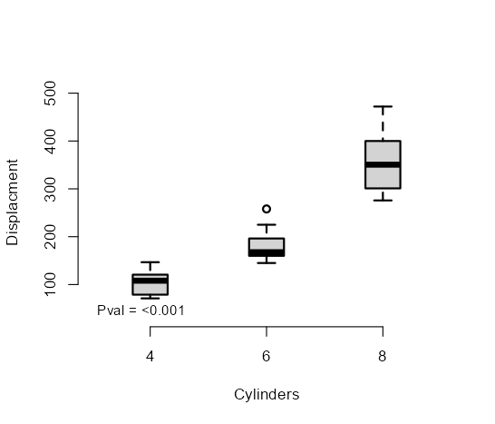
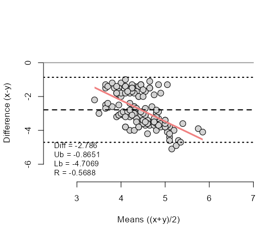

# Custom R plots for exploratory analyses

These R functions (Splot, Bplot, BAplot) are for drawing plots with accompanying stats, which may be particularly useful in the exploratory phase of data analysis.


```R
# Scatter plot
# requires: install.packages("jtools")
Splot(mtcars$wt, mtcars$mpg,
      ylb = "Miles per gallon",
      xlb = "Weight")
```


```R
# Boxplot
Bplot(as.factor(mtcars$cyl), mtcars$disp,
      ylb = "Displacment",
      xlb = "Cylinders")
```



```R
# Bland-Altman plot
BAplot(iris$Sepal.Length, iris$Sepal.Width)
```


